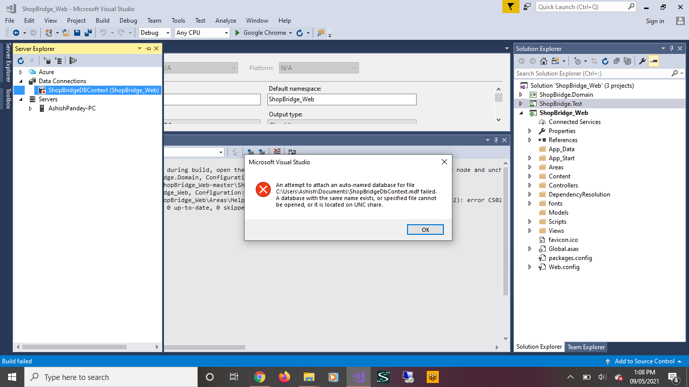
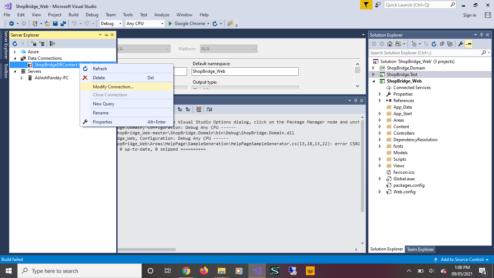
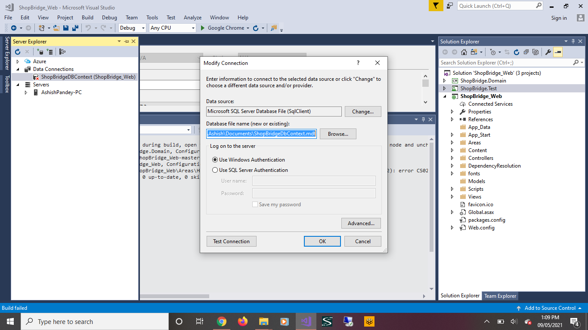
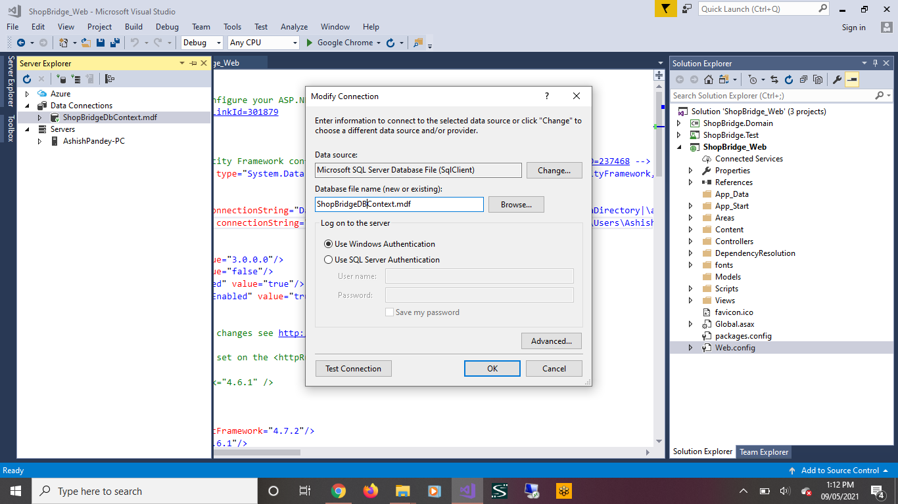
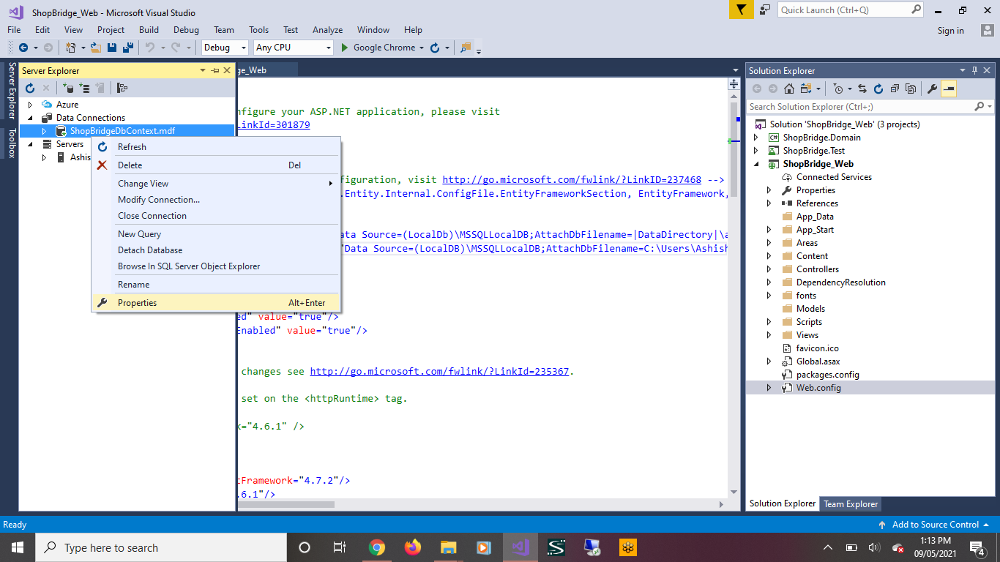
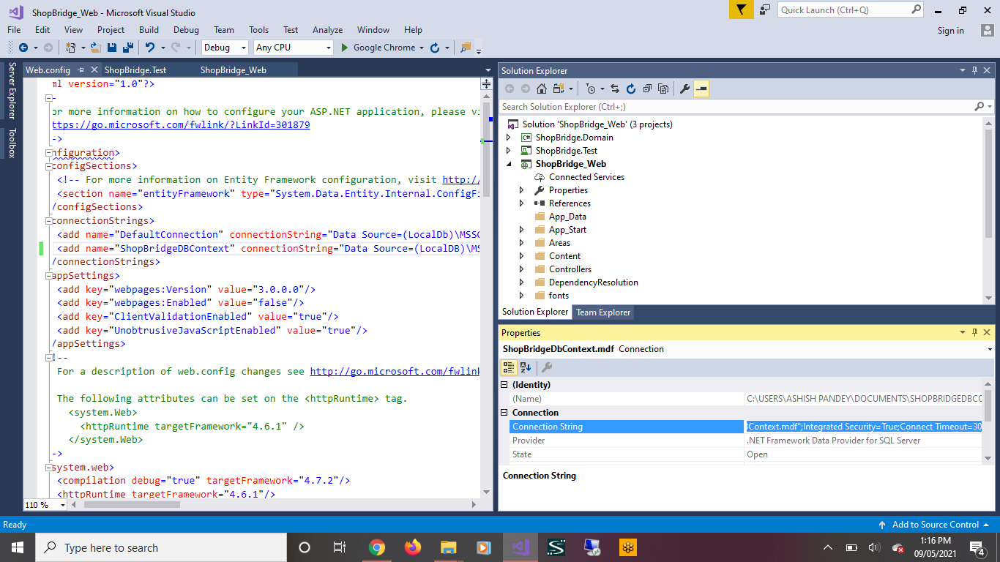
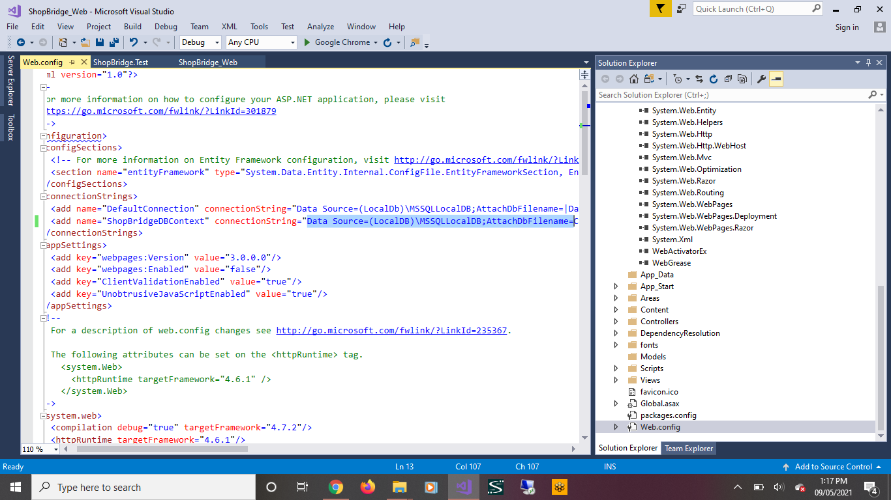

# ShopBridge_Web

This is a backend solution for Product functionality to be used by Product Admin, and perform below action : 

1.  Add a new item to the inventory (The item should require a name, description, and price as basic fields, think of additional information that would be useful)
2.  Modify an item in the inventory.  
3.  Delete an item from the inventory.  
4.  Lists the items in the inventory.

# Tracking

Following is an estimation for time I took to Impliment the diifrent pieces of the application

1.  Data store design  - 30mins
2.  API and service logic - 2hrs     
3.  Unit Test Coverage - 2hrs

# Prerequisite

The project is built uisng .net framework 4.7.2. Its recomended to have that version installed on the machine before trying to run/debug this project.

# Setup

Since I have used Microsoft SQL Server Database File for the data connection and that file is refrencing to my local path, so as part of setup we will just have to change the path for the connection string in the web.config before we start playing with the API's. Through follwing images I am going to show what exactly we need to change.
    
     - Go to Server Explorer > Data Connection expand.
     - Right click on the ShopBridgeDBContext (ShopBridge_Web) which has red cross next to it and click Modify Connection.
     - In the Modify Connection tab clear out the Database File Name field and type in ShopBridgeDBContext and save.
     - You we see the ShopBridgeDBContext is now active and just right click on it and click properties.
     - From the properties tab copy the connection string value and open the web.config file in the ShopBridge_Web project and paste that value in the connectionString attribute. That's it, we are good to run/debug the project.
    

